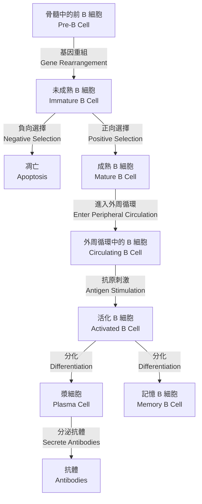
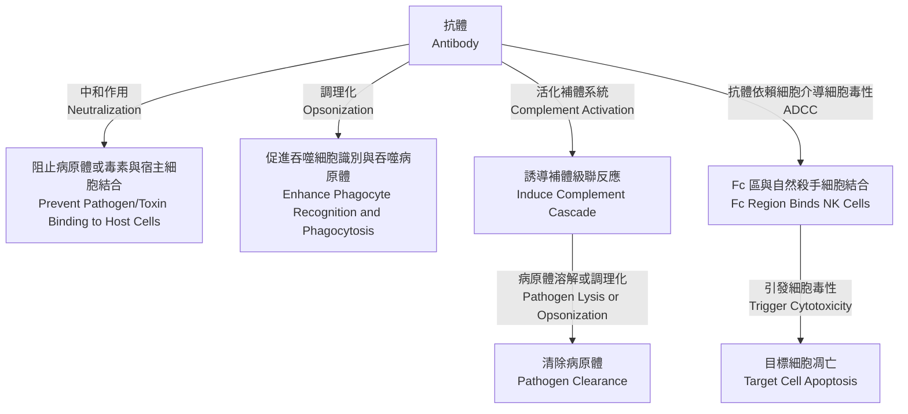

# 後天免疫 Adaptive Immunity

## 簡介 Introduction
後天免疫（Adaptive Immunity）屬於特異性防禦機制，對特定抗原（Antigen）產生針對性反應，具有專一性（Specificity）與記憶性（Memory），通常於初次感染後 4–7 天活化。後天免疫的核心細胞為淋巴細胞（Lymphocytes），包括 B 細胞（B Cells）與 T 細胞（T Cells），透過複雜的抗原識別與訊號傳遞機制，精準清除病原體並形成長期保護。

## 特徵 Characteristics
- **特異性（Specificity）**：針對特定抗原表位（Epitope）產生反應，透過受體重組（Receptor Recombination）產生多樣性。
- **記憶性（Memory）**：初次接觸抗原後形成記憶細胞（Memory Cells），二次感染時反應更快、更強。
- **自體辨識（Self-Recognition）**：透過免疫耐受（Immune Tolerance）避免攻擊自身組織。
- **克隆擴增（Clonal Expansion）**：識別抗原的淋巴細胞大量增殖，形成效應細胞群。

## 主要細胞 Components

### B 細胞 B Cells
- **起源與分化**：源自骨髓（Bone Marrow），在骨髓中進行 B 細胞受體（B Cell Receptor, BCR）基因重組，完成正向與負向選擇後進入外周循環。

- **功能**：經抗原刺激分化為漿細胞（Plasma Cells），分泌抗體（Antibodies），如 IgM、IgG、IgA、IgE、IgD。
- **活化機制**：需要二訊號：抗原結合 BCR 以及輔助性 T 細胞（Helper T Cells）提供的共刺激訊號（如 CD40-CD40L 交互作用）。
- **記憶 B 細胞（Memory B Cells）**：長期存活，二次感染時快速分化為漿細胞，產生高親和力抗體。
- **臨床意義**：B 細胞缺陷導致體液免疫缺乏，如 X 染色體相關無丙種球蛋白血症（X-linked Agammaglobulinemia），患者易患細菌感染。

### 輔助性 T 細胞 Helper T Cells, CD4+ T Cells
- **起源與分化**：源自胸腺（Thymus），經正向與負向選擇形成成熟 CD4+ T 細胞，分化為不同亞型：Th1、Th2、Th17 及調節性 T 細胞（T Regulatory Cells, Treg）。
- **功能與分泌細胞激素（Cytokines）**：
  - **Th1**：分泌干擾素-γ（Interferon-γ, IFN-γ）、白細胞介素-2（Interleukin-2, IL-2），促進細胞免疫（Cell-mediated Immunity），活化巨噬細胞對抗胞內病原體。
  - **Th2**：分泌白細胞介素-4（Interleukin-4, IL-4）、IL-5、IL-13，協助 B 細胞產生抗體（Humoral Immunity），參與過敏反應與寄生蟲防禦。
  - **Th17**：分泌白細胞介素-17（Interleukin-17, IL-17）、IL-22，參與黏膜防禦及發炎反應，對抗真菌與胞外細菌。
  - **Treg**：分泌轉化生長因子 β（Transforming Growth Factor-β, TGF-β）、IL-10，抑制過度免疫反應，維持免疫耐受。
- **活化機制**：需抗原呈遞細胞（Antigen-Presenting Cells, APCs）透過主要組織相容性複合體 II 類（Major Histocompatibility Complex II, MHC II）呈遞抗原至 T 細胞受體（T Cell Receptor, TCR），並提供共刺激訊號（如 B7-CD28）。
- **臨床意義**：CD4+ T 細胞缺陷（如 HIV 感染）導致免疫系統崩潰，易患機會性感染。

### 細胞毒性 T 細胞 Cytotoxic T Lymphocytes, CTLs; CD8+ T Cells
- **起源與分化**：源自胸腺（Thymus），識別 MHC I 類分子呈遞的抗原。
- **功能**：識別並殺死表現異常抗原的細胞（如病毒感染細胞、腫瘤細胞），釋放穿孔素（Perforin）與顆粒酶（Granzymes）誘導目標細胞凋亡（Apoptosis）。
- **活化機制**：需 MHC I 類分子呈遞抗原至 TCR，並接受輔助性 T 細胞分泌的 IL-2 刺激增殖。
- **臨床意義**：CTLs 在抗病毒與抗腫瘤免疫中至關重要，免疫檢查點抑制劑（Checkpoint Inhibitors）如 anti-PD-1 可增強 CTL 活性。

## 免疫記憶 Immunological Memory
部分 B 與 T 細胞在初次應答後分化為記憶細胞（Memory Cells），長期存活於淋巴結與外周組織中。記憶細胞具有以下特徵：
- 二次反應更快（數小時至 1-2 天）。
- 產生更高親和力抗體（Affinity Maturation）。
- 需要較少抗原刺激即可活化。
記憶細胞是疫苗（Vaccines）產生長期保護的基礎。

## 抗體 Antibodies
抗體（Antibodies）又稱免疫球蛋白（Immunoglobulins），由漿細胞（Plasma Cells）分泌，結構呈 Y 字形，包含兩條重鍊（Heavy Chains）與兩條輕鍊（Light Chains），由可變區（Variable Region）識別抗原，恆定區（Constant Region）決定功能。主要功能包括：

- **中和作用（Neutralization）**：結合病原體或毒素，阻止其與宿主細胞結合。
- **調理化（Opsonization）**：促進吞噬細胞（Phagocytes）識別與吞噬病原體。
- **活化補體系統（Complement Activation）**：經經典路徑（Classical Pathway）誘導補體級聯反應，導致病原體溶解或調理化。
- **抗體依賴細胞介導細胞毒性（Antibody-Dependent Cellular Cytotoxicity, ADCC）**：Fc 區與自然殺手細胞（NK Cells）結合，引發細胞毒性。

### 類型 Classes
- **IgM**：初次免疫時產生，五聚體結構，效率高，後轉換為 IgG；主要存在於血液中，活化補體系統。
- **IgG**：最常見，單體結構，能穿透胎盤提供被動免疫，參與二次免疫反應；具高親和力，廣泛分布於血液與組織液。
- **IgA**：分泌型，二聚體結構，存在於黏膜與體液（如唾液、淚液、乳汁），保護呼吸道與腸道；防止病原體黏附於黏膜表面。
- **IgE**：與過敏反應及寄生蟲感染相關，結合肥大細胞（Mast Cells）與嗜鹼性白血球（Basophils），引發脫粒作用（Degranulation）釋放組織胺（Histamine）。
- **IgD**：表面表達於 B 細胞，功能尚未完全闡明，可能參與 B 細胞活化。

### 抗體多樣性 Antibody Diversity
抗體多樣性由以下機制產生：
- **V(D)J 重組（V(D)J Recombination）**：在 B 細胞分化過程中，可變區基因片段隨機重組。
- **體細胞高頻突變（Somatic Hypermutation）**：在胚中心（Germinal Center）中，B 細胞基因突變提高抗體親和力。
- **類別轉換（Class Switching）**：改變抗體恆定區，從 IgM 轉換為 IgG、IgA 或 IgE，以適應不同免疫需求。

## 抗原呈遞與 MHC 分子 Antigen Presentation and MHC Molecules
- **主要組織相容性複合體（Major Histocompatibility Complex, MHC）**：
  - **MHC I 類**：表達於所有有核細胞，呈遞內源性抗原（如病毒蛋白）至 CD8+ T 細胞。
  - **MHC II 類**：表達於抗原呈遞細胞（APCs，如樹突細胞、巨噬細胞、B 細胞），呈遞外源性抗原至 CD4+ T 細胞。
- **抗原處理（Antigen Processing）**：
  - 內源性路徑：細胞內蛋白經蛋白酶體（Proteasome）降解，片段與 MHC I 結合。
  - 外源性路徑：吞噬或內吞的抗原在溶酶體（Lysosome）中降解，與 MHC II 結合。
- **臨床意義**：MHC 多態性影響器官移植排斥反應與自體免疫疾病易感性。

## 後天免疫的活化與調節 Activation and Regulation of Adaptive Immunity
- **二訊號假說（Two-Signal Hypothesis）**：淋巴細胞活化需要抗原識別訊號與共刺激訊號，缺乏共刺激導致無反應性（Anergy）。
- **胚中心反應（Germinal Center Reaction）**：B 細胞在淋巴結胚中心中進行親和力成熟與類別轉換。
- **免疫檢查點（Immune Checkpoints）**：如 CTLA-4 與 PD-1/PD-L1，抑制 T 細胞過度活化，防止自體免疫。

## 臨床意義 Clinical Significance
- **疫苗（Vaccines）**：利用免疫記憶原理，透過減毒或滅活病原體誘導保護性免疫，如流感疫苗、HPV 疫苗。
- **自體免疫疾病（Autoimmune Diseases）**：後天免疫失調導致自身組織攻擊，如系統性紅斑狼瘡（SLE）、類風濕性關節炎（RA）。
- **免疫缺乏症（Immunodeficiency）**：如選擇性 IgA 缺乏症，患者易患呼吸道與腸道感染。
- **癌症免疫治療（Cancer Immunotherapy）**：增強後天免疫，如 CAR-T 細胞療法與檢查點抑制劑，針對腫瘤細胞。

## 參考文獻 References
1. Abbas AK, Lichtman AH, Pillai S. _Cellular and Molecular Immunology_. 9th ed. Elsevier; 2017.
2. Murphy K. _Janeway's Immunobiology_. 9th ed. Garland Science; 2016.
3. Chaplin DD. Overview of the immune response. _J Allergy Clin Immunol_. 2010;125(2 Suppl 2):S3-23.