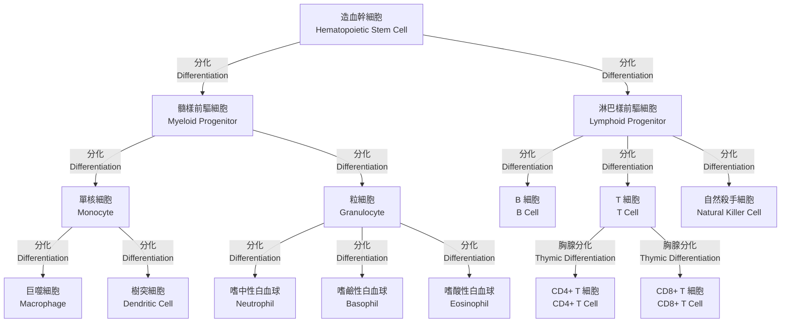

# 主要免疫細胞時序與分泌物質 Immune Cells Timeline and Secreted Molecules

## 簡介 Introduction
本章將詳述人體主要免疫細胞（Immune Cells）的活化時序（Activation Timeline）、起源（Origin）、表面標記（Surface Markers）、功能（Functions）與分泌物質（Secreted Molecules），並探討其在不同免疫階段中的角色與臨床意義。

## 活化時序 Activation Timeline
| 細胞 Cell Type | 啟動時機 Activation Time | 起源 Origin | 表面標記 Surface Markers | 分泌物質 Secreted Molecules |
| ------------- | ----------------------- | --------------------------- | ------------------------- | ---------------------------- |
| 嗜中性白血球 (Neutrophils) | 0.5–2 小時 | 骨髓 (Bone Marrow) | CD15, CD16 | Elastase, Myeloperoxidase, Reactive Oxygen Species (ROS) |
| 自然殺手細胞 (NK Cells) | 0.5–2 天 | 骨髓 (Bone Marrow) | CD56, CD16 | Perforin, Granzyme B, Interferon-γ (IFN-γ) |
| 巨噬細胞 (Macrophages) | 1–3 天 | 單核球分化 (Monocyte Differentiation) | CD14, CD68 | Tumor Necrosis Factor-α (TNF-α), Interleukin-1 (IL-1), Interleukin-6 (IL-6) |
| 樹突細胞 (Dendritic Cells) | 1–3 天 | 骨髓 (Bone Marrow) | CD11c, MHC II | Interleukin-12 (IL-12), Interleukin-23 (IL-23) |
| 輔助性 T 細胞 (Helper T Cells, CD4+) | 4–7 天 | 胸腺 (Thymus) | CD3, CD4 | Interferon-γ (IFN-γ), IL-2, IL-4, IL-17 |
| 細胞毒性 T 細胞 (Cytotoxic T Cells, CD8+) | 4–7 天 | 胸腺 (Thymus) | CD3, CD8 | Perforin, Granzymes |
| B 細胞 (B Cells) | 4–7 天 | 骨髓 (Bone Marrow) | CD19, CD20 | IgM, IgG, IgA, IgE |
| T 調節細胞 (T Regulatory Cells, Treg) | 4–7 天 | 胸腺/外周 (Thymus/Periphery) | CD4, CD25, FOXP3 | Transforming Growth Factor-β (TGF-β), IL-10 |

## 細胞詳述 Detailed Descriptions
### 嗜中性白血球 (Neutrophils)
- 發生與分化：造血幹細胞 (Hematopoietic Stem Cells) 經粒細胞生成作用 (Granulopoiesis) 於骨髓分化而成。
- 活化機制：趨化因子 (CXCL8) 與病原體相關分子模式 (PAMPs) 結合 Toll-like receptor 4 (TLR4) 引發活化。
- 主要功能：吞噬 (Phagocytosis)、產生中性白血球胞外陷阱 (Neutrophil Extracellular Traps, NETs)、氧化爆發 (Oxidative Burst)。
- 臨床意義：嗜中性白血球增多常見於急性細菌感染；減少則易併發感染。

### 自然殺手細胞 (NK Cells)
- 發生與分化：源自骨髓的淋巴系細胞，非胸腺依賴。
- 活化機制：缺失 MHC I 分子之細胞、抗體依賴細胞介導細胞毒性 (ADCC)。
- 主要功能：釋放穿孔素 (Perforin) 與顆粒酶 (Granzymes) 誘導目標細胞凋亡。
- 臨床意義：在病毒感染與腫瘤監視 (Tumor Surveillance) 中扮演關鍵角色。

### 巨噬細胞 (Macrophages)
- 發生與分化：外周血單核球進入組織後分化。
- 活化機制：病原體結合模式識別受體 (Pattern Recognition Receptors, PRRs)；可分為經典活化 (M1) 與替代活化 (M2)。
- 主要功能：吞噬 (Phagocytosis)、抗原呈遞 (Antigen Presentation)、調節發炎反應。
- 臨床意義：M1 型與慢性發炎、組織破壞相關；M2 型參與組織修復。

### 樹突細胞 (Dendritic Cells)
- 發生與分化：骨髓來源，可分為常駐性與遷移性樹突細胞。
- 功能：最有效的專職抗原呈遞細胞 (Professional Antigen-Presenting Cell)，引發初次 T 細胞活化。

### T 細胞與 B 細胞
- T 細胞：包括輔助性 (CD4+) 與細胞毒性 (CD8+)；活化需二訊號：TCR 與 MHC-I/II 結合，以及共刺激分子 (e.g. CD28)。
- B 細胞：受體為膜結合型抗體；經活化分化為漿細胞 (Plasma Cells) 分泌抗體。

## 免疫細胞的發育與分化 Development and Differentiation of Immune Cells
免疫細胞主要起源於骨髓中的造血幹細胞，通過一系列分化過程形成不同的免疫細胞系。以下是主要免疫細胞的發育路徑：

## 臨床相關 Clinical Correlations
- 自體免疫疾病 (Autoimmunity)：如類風濕性關節炎 (Rheumatoid Arthritis)、系統性紅斑狼瘡 (SLE)。
- 免疫缺乏 (Immunodeficiency)：如 HIV 感染導致 CD4+ T 細胞減少。
- 免疫治療 (Immunotherapy)：單株抗體、CAR-T 細胞治療等。

## 參考文獻 References
1. Abbas AK, Lichtman AH, Pillai S. _Cellular and Molecular Immunology_. 9th ed. Elsevier; 2017.
2. Murphy K. _Janeway's Immunobiology_. 9th ed. Garland Science; 2016.
3. Chaplin DD. Overview of the immune response. _J Allergy Clin Immunol_. 2010;125(2 Suppl 2):S3-23.