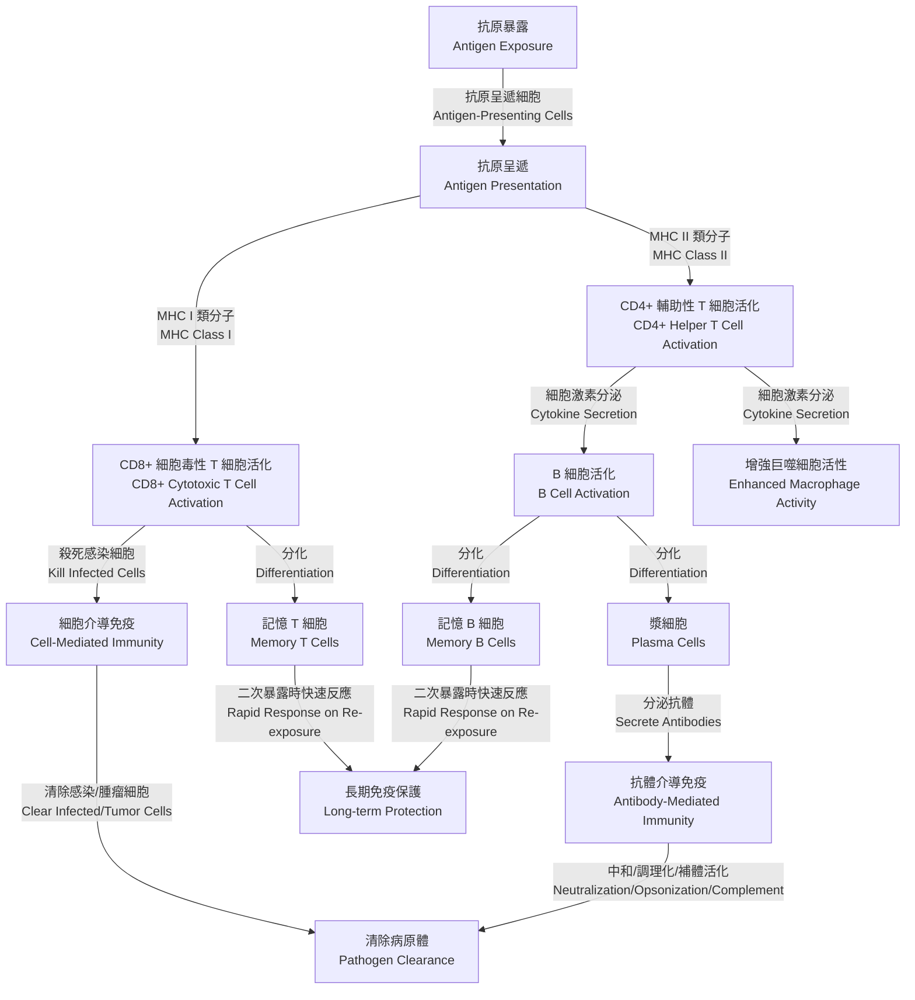

# 人體免疫系統 Immune System

## 1. 概述 Overview
人體免疫系統分為先天免疫 (Innate Immunity) 與後天免疫 (Adaptive Immunity)。先天免疫為非特異性防禦，啟動快速（分鐘到小時級別），而後天免疫為特異性防禦，具有免疫記憶，通常在感染後數天（4–7 天）後活化。

## 2. 先天免疫 Innate Immunity

- **巨噬細胞 (Macrophages)**：吞噬（phagocytosis）病原體，分泌腫瘤壞死因子 α（Tumor Necrosis Factor-α, TNF-α）、白細胞介素-1（Interleukin-1, IL-1）、白細胞介素-6（Interleukin-6, IL-6）。
- **樹突細胞 (Dendritic Cells)**：吞噬並呈遞抗原（antigen presentation）給 T 細胞，分泌白細胞介素-12（Interleukin-12, IL-12），連結先天與後天免疫。
- **自然殺手細胞 (Natural Killer Cells, NK Cells)**：識別並殺死病毒感染細胞與腫瘤細胞，釋放穿孔素（Perforin）及顆粒酶 B（Granzyme B）。
- **中性粒細胞 (Neutrophils)**：首批抵達感染部位，透過吞噬（phagocytosis）及產生網狀外陷阱（Neutrophil Extracellular Traps, NETs），分泌彈性蛋白酶（Elastase）、髓過氧化物酶（Myeloperoxidase）。
- **補體系統 (Complement System)**：一系列血漿蛋白，活化後可調理化（opsonization）、誘導細胞溶解（Membrane Attack Complex, MAC）生成，以及招募免疫細胞（chemotaxis）。

## 3. 後天免疫 Adaptive Immunity

- **B 細胞 (B Cells)**：經抗原刺激分化為漿細胞（Plasma Cells），分泌抗體（Antibodies），包括 IgM、IgG、IgA、IgE、IgD。

- **T 輔助細胞 (Helper T Cells, CD4+ T Cells)**：分化為 Th1、Th2、Th17 及調節性 T 細胞（T Regulatory Cells, Treg），分泌不同細胞激素（Cytokines）：
  - **Th1**：分泌干擾素 γ（Interferon-γ, IFN-γ）、IL-2，促進細胞免疫（Cell-mediated Immunity）。
  - **Th2**：分泌 IL-4、IL-5、IL-13，協助 B 細胞產生抗體（Humoral Immunity）。
  - **Th17**：分泌 IL-17，參與黏膜防禦及發炎反應。
  - **Treg**：分泌轉化生長因子 β（Transforming Growth Factor-β, TGF-β）、IL-10，抑制過度免疫反應。
- **細胞毒性 T 細胞 (Cytotoxic T Lymphocytes, CTLs; CD8+ T Cells)**：識別並殺死表現異常抗原的細胞，釋放穿孔素（Perforin）和顆粒酶（Granzymes）。
- **免疫記憶 (Immunological Memory)**：部分 B 與 T 細胞在初次應答後分化為記憶細胞（Memory Cells），再次遇到相同抗原時可迅速活化。

## 4. 主要免疫細胞時序與分泌物質

| 細胞 Cell Type | 啟動時機 Activation | 分泌物質 Secreted Molecules |
| ------------- | ------------------- | ----------------------------- |
| 中性粒細胞 (Neutrophils) | 0.5–2 小時 | Elastase, Myeloperoxidase, ROS |
| 自然殺手細胞 (NK Cells) | 0.5–2 天 | Perforin, Granzyme B, IFN-γ |
| 巨噬細胞 (Macrophages) | 1–3 天 | TNF-α, IL-1, IL-6 |
| 樹突細胞 (Dendritic Cells) | 1–3 天 | IL-12, IL-23 |
| CD4+ T 細胞 (Helper T Cells) | 4–7 天 | IFN-γ, IL-2, IL-4, IL-17 |
| CD8+ T 細胞 (CTLs) | 4–7 天 | Perforin, Granzymes |
| B 細胞 (B Cells) | 4–7 天 | IgM → IgG/IgA/IgE |
| Treg 細胞 (T Regulatory Cells) | 4–7 天 | TGF-β, IL-10 |

## 5. Th1 與 Th2 平衡的重要性 Importance of Th1 and Th2 Balance

輔助性 T 細胞（Helper T Cells, CD4+ T Cells）在免疫系統中扮演關鍵角色，特別是通過分化為不同的亞型來調節免疫反應。其中，Th1 和 Th2 細胞是兩個主要的亞型，它們之間的平衡對於維持免疫系統的正常功能至關重要。

### Th1 細胞的作用 Role of Th1 Cells
- **主要功能**：Th1 細胞主要負責細胞介導免疫（Cell-mediated Immunity），通過分泌干擾素-γ（Interferon-γ, IFN-γ）和白細胞介素-2（Interleukin-2, IL-2）來活化巨噬細胞和其他免疫細胞，對抗胞內病原體（如病毒和某些細菌）。
- **防禦目標**：Th1 反應對於清除胞內感染和腫瘤細胞特別有效。

### Th2 細胞的作用 Role of Th2 Cells
- **主要功能**：Th2 細胞主要負責體液免疫（Humoral Immunity），通過分泌白細胞介素-4（Interleukin-4, IL-4）、IL-5 和 IL-13 來促進 B 細胞產生抗體，特別是 IgE 和 IgG1。
- **防禦目標**：Th2 反應對於對抗胞外寄生蟲（如蠕蟲）和過敏原有效，但也與過敏反應相關。

### Th1/Th2 平衡的意義 Importance of Balance
- **免疫調節**：Th1 和 Th2 細胞之間的平衡決定了免疫反應的方向。正常情況下，免疫系統會根據病原體的性質調整 Th1 或 Th2 的主導地位。例如，病毒感染通常引發 Th1 反應，而寄生蟲感染則引發 Th2 反應。
- **相互抑制**：Th1 和 Th2 細胞通過分泌的細胞激素相互抑制。例如，Th1 細胞分泌的 IFN-γ 抑制 Th2 細胞的增殖，而 Th2 細胞分泌的 IL-4 和 IL-10 抑制 Th1 細胞的活性。這種相互制衡機制有助於避免單一免疫反應過度活躍。

### 失衡的後果 Consequences of Imbalance
- **Th1 主導失衡**：若 Th1 反應過度活躍，可能導致自體免疫疾病，如類風濕性關節炎（Rheumatoid Arthritis）或多發性硬化症（Multiple Sclerosis），因為過度的細胞介導免疫會攻擊自身組織。
- **Th2 主導失衡**：若 Th2 反應過度活躍，可能導致過敏性疾病（如哮喘、過敏性鼻炎）或某些寄生蟲感染的慢性化，因為過度的體液免疫和 IgE 產生會引發過敏反應。
- **疾病進展影響**：Th1/Th2 失衡也影響某些疾病的進展。例如，在 HIV 感染中，Th1 反應的減弱可能加速疾病進展，而在妊娠期間，Th2 反應的增強有助於避免母體免疫系統攻擊胎兒，但可能增加對某些感染的易感性。

### 臨床意義 Clinical Significance
- **治療策略**：理解 Th1/Th2 平衡有助於設計針對性治療。例如，在自體免疫疾病中，抑制 Th1 反應或增強 Th2 反應可能緩解症狀；而在過敏性疾病中，抑制 Th2 反應或增強 Th1 反應可能有效。
- **疫苗設計**：疫苗開發中，調整佐劑（Adjuvants）以偏向 Th1 或 Th2 反應可提高疫苗對特定病原體的保護效果。
- **生物標誌**：Th1 和 Th2 相關細胞激素水平可用作疾病診斷或進展的生物標誌。

Th1 和 Th2 平衡是免疫系統精細調節的體現，維持這種平衡對於有效防禦病原體、避免自體免疫和過敏反應至關重要。未來研究可能進一步揭示調節這種平衡的分子機制，為免疫相關疾病提供新的治療靶點。